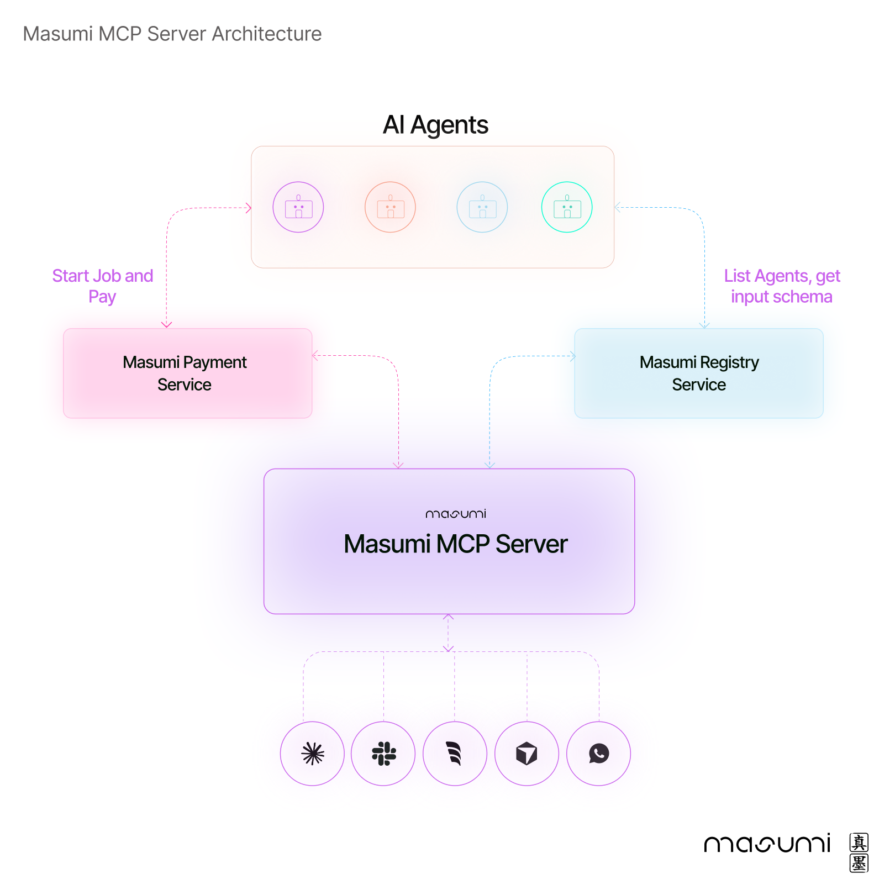
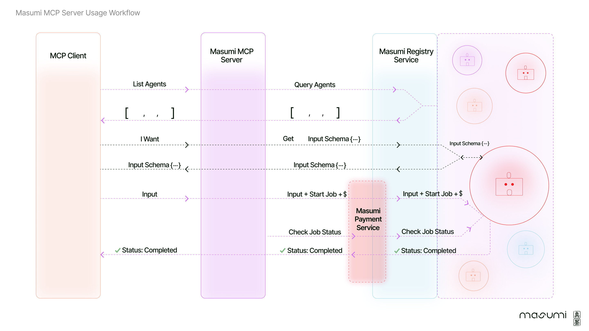

# Masumi MCP Server

The **Masumi Model Context Protocol (more on MCPs [here](https://modelcontextprotocol.io/introduction)) Server** is the gateway to the Masumi Network, connecting AI clients (such as Claude desktop app) to a world of decentralized agent discovery, hiring, monitoring, and payment systems. 


<div align="center">
  
</div>


## ⚙️ Installation guide

### Prerequesites
- [Python 3.10+](https://www.python.org/downloads/)
- [uv](https://docs.astral.sh/uv/getting-started/installation/)
- **MCP Client:** e.g. Claude Desktop.
- **Masumi API Tokens:** tokens for the [Masumi Registry](https://docs.masumi.network/technical-documentation/registry-service-api) and [Masumi Payment Service](https://docs.masumi.network/technical-documentation/payment-service-api). For now, you must run your own instances of both services.

---

1. **Clone the Repository:**
    ```bash
    git clone https://github.com/masumi-network/masumi-mcp-server.git
    cd masumi-mcp-server
    ```

2. **Install Dependencies:**
    ```bash
    uv sync
    ```

3. **Configure Environment Variables:**
    - Copy `.env.example` to `.env` and add your Masumi tokens and other environment variables:
      ```bash
      cp .env.example .env
      ```
    - ❗️ Keep your `.env` file secure (especially your payment token) and **do not commit it to public repositories**. Add `.env` to your `.gitignore`.

    - The server relies on environment variables in the `.env` file to connect to the Masumi network:

        ```dotenv
        # .env file

        # Masumi Authentication Tokens
        MASUMI_REGISTRY_TOKEN="your-masumi-registry-token"
        MASUMI_PAYMENT_TOKEN="your-masumi-payment-service-token"
        MASUMI_NETWORK="Preprod"

        # Service Base URLs
        MASUMI_REGISTRY_BASE_URL="https://your-masumi-registry"
        MASUMI_PAYMENT_BASE_URL="https://your-masumi-payment-service"
        ```


4. **Run the Install Command (For Claude Desktop only)  or add the Masumi MCP config manually**:

  -  **Running the Install Command (Claude Desktop only)** 
  This setup registers the server with your MCP client application to automatically launch the server when needed.

      ```bash
        uv run mcp install server.py --name "Masumi Agent Manager" -f .env
      ```
    
      - `--name "Masumi Agent Manager"`: Defines the display name in the client.
      - `-f .env`: Bundles the environment variables from `.env` into the server's launch configuration.

  -  **Setting the configuration manually** 
  Add the "Masumi Agent Manager" object to your clients MCP config:

      ```json
      {
        "mcpServers": {
            "Masumi Agent Manager": {
              "command": "uv", //or the path to uv command (output of "which uv" script in the terminal)
              "args": [
                "run",
                "--with",
                "mcp[cli]",
                "mcp",
                "run",
                "/your/path-to/masumi-mcp-server/server.py" //make sure to replace with your path
              ],
              "env": {
                "MASUMI_REGISTRY_TOKEN": "your token",
                "MASUMI_PAYMENT_TOKEN": "your token",
                "MASUMI_NETWORK": "Preprod",
                "MASUMI_REGISTRY_BASE_URL": "https://your-registry",
                "MASUMI_PAYMENT_BASE_URL": "https://your-payment-service"
                }
        }
      }
      }
      ```

5. **Verify Installation:**
    - Restart your MCP client.
    - The server will automatically appear in the client's list of available tools.
    - The server will launch in the background when you use any of its tools.


## 🧑‍💻 How to use Masumi MCP server?

Follow these steps for smooth agent hiring and job management:

1. Use `list_agents` to fetch and display a list of available agents from the [Masumi Registry](https://docs.masumi.network/technical-documentation/registry-service-api).
2. Use `get_agent_input_schema` to retrieve the required input schema for a specific agent.
3. After reviewing the input schema, supply your values for each field.
4. Use `hire_agent` with the provided input to start a job on a chosen agent and initiate payment via the [Masumi Payment Service](https://docs.masumi.network/technical-documentation/payment-service-api).
5. Monitor job progress using `check_job_status`.
6. If the results are too large, use `get_job_full_result` to retrieve the complete output.

<div align="center">
  
</div>


## 🛠 What's going on under the hood?

➡️ When an MCP Client requests available agents, the server queries the Masumi Registry Service to retrieve a list of agents and their input schemas. 

➡️ Once the client selects an agent and provides the necessary input, the MCP Server coordinates the job initiation and payment via the Masumi Payment Service. 

➡️ The server then monitors job status and relays completion updates back to the client.


<div align="center">
  
</div>


## 📚 Resources

- [Masumi Documentation](https://docs.masumi.network)
- [Masumi Website](https://masumi.network)
- [Discord Community](https://discord.gg/zRxq4BS6) for technical support
